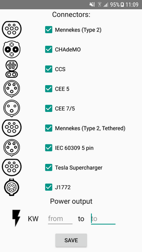

## My project

**Application description**: This project allows you to search for charging stations for electric vehicles in Slovakia. Each charging station contains basic information about the charging location such as location(town, address), status, usage restrictions, cost per kWh, operator and information about available connectors(Type of connector, quantity, power output).

- Application provides a possibility to filter charging stations by connector types and power output. Selected filters will be applied in all further searches unless the filter is changed.
- There are three possible types of searches in the application:
  - **Nearby** - After GPS location tracking is enabled in action bar and your position is determined, it is possible to search for all charging stations in a given radius from your location.
  - **Along the route** - Searches for charging stations that are within the given distance from a given route. This works for any highways and expressways in Slovakia.
  - **Specific area** - Searches for charging stations in a given region or a district.

**Screenshots from the application**

1. All charging stations in slovakia 
2. details of a charging station
3. filtering options
4. charging stations along the D1 highway within 5 km radius.

 
 

**Technologies used**: Android, Java, Spring, Google Volley - REST API, Mapbox Android SDK, PostgreSQL, PostGIS

## Data sources

- [Open Street Maps](https://www.openstreetmap.org/) - routes, region and district areas
- [Open Charge Map](https://openchargemap.org/site/develop#api) - charging stations locations and data

# Frontend
Fronted is an Android application which uses Mapbox Android SDK to render maps and  markers supplied to it. The application contains action bar with three controls:
- GPS localization - uses GPS to find user location and adds a green marker to that location
- Filter - Allows users to filter by chosen connector types and min/max power output (screen 3)
- Search - Allows users to search for charging stations in a specific modes - nearby, along the route and in a specific region

After user clicks on the marker of a charging station, basic information about the station is shown. Filtering window contains a list of all charging connector types with images in Slovakia. Search window provides three search modes with description and fields to enter required data.

# Backend
Backend is a server based on the Spring framework. It runs a PostgreSQL database with PostGIS extension. Database was filled with openstreetmaps data for whole Slovakia. Downloaded .osm.pbf file was imported into database using osm2pgsql. Charging stations data were downloaded using publicly accessible openchargemap.org API. Downloaded JSON was parsed into individual charging station objects and saved into DB. Location coordinates from both - openstreetmaps and openchargemap data were converted to WGS 84(4326) projection.

**Api**
Server provides following REST services:
- **pois** (points of interest - charging stations)
  - retrieves all charging stations in Slovakia
  - applies connector filters
  - called on application start without any filters
  
Example: `http://ip_address_of_server:8080/pois?mennekes=true&chademo=true&ccs=true&cee5=true&cee75=true&mennekest=true&iec=true&tesla=true&j1772=true&kwfrom=0&kwto=0`
***
- **nearby** (within the given distance from users` location)
  - retrievies charging station within the given distance from users` location
  - applies connector filters
  
Example with 20 km radius: `http://ip_address_of_server:8080/nearby?mennekes=true&chademo=true&ccs=true&cee5=true&cee75=true&mennekest=true&iec=true&tesla=true&j1772=true&kwfrom=0&kwto=0&lat=48.1563651&lng=17.1102536&radius=20000`
***
- **along the route** (along highways and expressways)
  - retrieves charging stations within given distance from given highway or expressway
  - applies connector filters
  
Example with 5 km radius and D1 highway: `http://ip_address_of_server:8080/along?mennekes=true&chademo=true&ccs=true&cee5=true&cee75=true&mennekest=true&iec=true&tesla=true&j1772=true&kwfrom=0&kwto=0&radius=5000&road=D1`
***
  - **somewhere** (in selected area)
    - retrieves charging stations in a given region or a district
    - applies connector filters
  
Example with Trnavský kraj: `http://ip_address_of_server:8080/somewhere?mennekes=true&chademo=true&ccs=true&cee5=true&cee75=true&mennekest=true&iec=true&tesla=true&j1772=true&kwfrom=0&kwto=0&district=Trnavský kraj`
***

Server respond to API calls with a JSON Array containing all information about relevant charging stations. Data about single charging station in response are shown in the following picture:

## Database

Database consists of the following tables:

- **poi** - table containing basic information about the point of interest (title, address, GPS coordinates)
- **charging_station** - contains information about the charging station (poi_id, status, usage restrictions, cost, operator...)
- **connection** - information about individual connector types present at specific location(chs_id, name, connector type, qunatity, power...)
- **planet_osm_line** - contains lines, part of openstreetmaps data for Slovakia
- **planet_osm_polygon** - contains polygons, part of openstreetmaps data for Slovakia 
- **planet_osm_roads** - contains roads, part of openstreetmaps data for Slovakia
- **planet_osm_point** - contains points, part of openstreetmaps data for Slovakia

Each query returns relevant charging stations with all data, so all corresponding tables have to be joined in the query. Here is the list of all three types of queries:

- **nearby** - query returns all charging stations in a given radius from users' location.
  - Joins relevant data from poi, charging station and connection tables
  - Cross join user location (ST_SetSRID(ST_MakePoint(17.1102536, 48.1563651),4326)) with chargin station locations
  - Find all charging stations that are not further from user location than given distance.
  - Apply connector filters ( AND (connectionTypeId = 25 ...))

Example with 10 km radius:
~~~~
SELECT DISTINCT poi.id FROM poi 
  JOIN charging_station chs ON poi.id = chs.poi_id 
  JOIN connection c ON c.chs_id = chs.id 
  CROSS JOIN ST_SetSRID(ST_MakePoint(17.1102536, 48.1563651),4326) 
  WHERE ST_DISTANCE(poi.way::geography, st_setsrid::geography) < 10000 
    AND (  connectionTypeId = 25 OR connectionTypeId = 2 ...)
~~~~
***
- **along the route** - query retrieves charging stations within given distance from given highway or expressway
  - Joins relevant data from poi, charging station and connection tables
  - Cross join planet_osm_line with charging station locations
  - Consider only highways and expressways (WHERE highway = 'motorway')
  - Find highway with given name (AND ref = 'D1' ) and stations within given distance from the highway (AND ST_DISTANCE(poi.way::geography, d.way::geography) < 5000)
  - Apply connector filters ( AND (connectionTypeId = 25 ...))
   
Example with 5 km radius and D1 highway: 
~~~~
SELECT DISTINCT poi.id FROM poi 
  JOIN charging_station chs ON poi.id = chs.poi_id 
  JOIN connection c ON c.chs_id = chs.id 
  CROSS JOIN planet_osm_line d 
  WHERE highway = 'motorway' 
    AND ref = 'D1' 
    AND ST_DISTANCE(poi.way::geography, d.way::geography) < 5000 
    AND (  connectionTypeId = 25 OR connectionTypeId = 2 ...)
~~~~
***

- **somewhere** - query retrieves charging stations in a given region or a district
  - Joins relevant data from poi, charging station and connection tables
  - Cross join with planet_osm_line with charging station locations
  - Consider regions and districts (WHERE (admin_level = '4' OR admin_level = '8'))
  - Get region of users's choice (AND d.name = 'Trnavský kraj' )
  - Find charging stations inside the region (AND ST_CONTAINS(d.way, poi.way))
  - Apply connector filters ( AND (connectionTypeId = 25 ...))
   
 Example with Trnavský kraj:
~~~~
SELECT DISTINCT poi.id FROM planet_osm_polygon d 
  CROSS JOIN poi 
  JOIN charging_station chs ON poi.id = chs.poi_id 
  JOIN connection c ON c.chs_id = chs.id 
  WHERE (admin_level = '4' OR admin_level = '8') 
    AND ST_CONTAINS(d.way, poi.way) 
    AND d.name = 'Trnavský kraj' 
    AND (  connectionTypeId = 25 OR connectionTypeId = 2 ...)
~~~~
